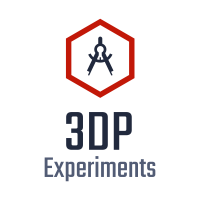

<!--
*** Thanks for checking out the Best-README-Template. If you have a suggestion
*** that would make this better, please fork the repo and create a pull request
*** or simply open an issue with the tag "enhancement".
*** Thanks again! Now go create something AMAZING! :D
***
***
***
*** To avoid retyping too much info. Do a search and replace for the following:
*** wilsongis, 3DP-experiments, twitter_handle, email, project_title, project_description
-->


<!-- PROJECT SHIELDS -->
<!--
*** I'm using markdown "reference style" links for readability.
*** Reference links are enclosed in brackets [ ] instead of parentheses ( ).
*** See the bottom of this document for the declaration of the reference variables
*** for contributors-url, forks-url, etc. This is an optional, concise syntax you may use.
*** https://www.markdownguide.org/basic-syntax/#reference-style-links
-->
[![Contributors][contributors-shield]][contributors-url]
[![Forks][forks-shield]][forks-url]
[![Stargazers][stars-shield]][stars-url]
[![Issues][issues-shield]][issues-url]
[![MIT License][license-shield]][license-url]
[![LinkedIn][linkedin-shield]][linkedin-url]


<!-- PROJECT LOGO -->
<br />
<p align="center">
  <a href="https://github.com/wilsongis/3DP_Experiments">
    
  </a>

  <h3 align="center">3DP Experiments</h3>

  <p align="center">
    A ML WSorkspace to allow me to isolate and reproduce my dissertation experiments.
    <br />
    <a href="https://github.com/wilsongis/3DP_Experiments"><strong>Explore the docs »</strong></a>
    <br />
    <br />
    <a href="https://github.com/wilsongis/3DP_Experiments/issues">Report Bug</a>
    ·
    <a href="https://github.com/wilsongis/3DP_Experiments/issues">Request Feature</a>
  </p>
</p>


<!-- TABLE OF CONTENTS -->
<details open="open">
  <summary><h2 style="display: inline-block">Table of Contents</h2></summary>
  <ol>
    <li>
      <a href="#about-the-project">About The Project</a>
      <ul>
        <li><a href="#built-with">Built With</a></li>
      </ul>
    </li>
    <li>
      <a href="#getting-started">Getting Started</a>
      <ul>
        <li><a href="#prerequisites">Prerequisites</a></li>
        <li><a href="#installation">Installation</a></li>
        <li><a href="#updating">Updating</a></li>
      </ul>
    </li>
    <li><a href="#usage">Usage</a></li>
    <li><a href="#roadmap">Roadmap</a></li>
    <li><a href="#contributing">Contributing</a></li>
    <li><a href="#license">License</a></li>
    <li><a href="#contact">Contact</a></li>
    <li><a href="#acknowledgements">Acknowledgements</a></li>
  </ol>
</details>


<!-- ABOUT THE PROJECT -->
## About The Project

[![Product Name Screen Shot][product-screenshot]](https://example.com)

This is a workspace for my dissertation experiments


### Built With

* [Machine Learning Workspaces](https://github.com/ml-tooling/ml-workspace#getting-started)
* [Docker for Data Science – A Step by Step Guide](https://dagshub.com/blog/setting-up-data-science-workspace-with-docker/)
* [dexpy](https://statease.github.io/dexpy/)


<!-- GETTING STARTED -->
## Getting Started


### Prerequisites

Install Docker

* See [Install Docker Engine](https://docs.docker.com/engine/install/)

### Installation

1. Clone the repo
   ```sh
   git clone https://github.com/wilsongis/3DP_Experiments.git
   ```
2. Enter workspace folder
   ```sh
   cd 3DP-Experiments
   ```
3. Create [ML Workspace](https://github.com/ml-tooling/ml-workspace#getting-started)
   ```sh
   docker run -d \
    -p 8080:8080 \
    --name "3DP-workspace" \
    -v "${PWD}:/workspace" \
    --env AUTHENTICATE_VIA_JUPYTER="mytoken" \
    --shm-size 512m \
    --restart always \
    mltooling/ml-workspace:0.12.1
   ```
4. Install Python Packages
    ```sh
    pip install -U pip setuptools wheel
    pip install -r requirements.txt
    ```
### Updating

    ```sh
    # If you have a `requirements.txt` file, you should install those requirements
    pip install -U pip setuptools wheel
    pip install -r requirements.txt
    ```

<!-- USAGE EXAMPLES -->
## Usage

Use this space to show useful examples of how a project can be used. Additional screenshots, code examples and demos work well in this space. You may also link to more resources.

_For more examples, please refer to the [Documentation](https://example.com)_


<!-- ROADMAP -->
## Roadmap

See the [open issues](https://github.com/wilsongis/3DP_Experiments/issues) for a list of proposed features (and known issues).


<!-- CONTRIBUTING -->
## Contributing

Contributions are what make the open source community such an amazing place to be learn, inspire, and create. Any contributions you make are **greatly appreciated**.

1. Fork the Project
2. Create your Feature Branch (`git checkout -b feature/AmazingFeature`)
3. Commit your Changes (`git commit -m 'Add some AmazingFeature'`)
4. Push to the Branch (`git push origin feature/AmazingFeature`)
5. Open a Pull Request


<!-- LICENSE -->
## License

Distributed under the MIT License. See `LICENSE` for more information.


<!-- CONTACT -->
## Contact

Your Name - [@wilsongis](https://twitter.com/wilsongis) - email

Project Link: [https://github.com/wilsongis/3DP_Experiments](https://github.com/wilsongis/3DP_Experiments)


<!-- ACKNOWLEDGEMENTS -->
## Acknowledgements

* []()
* []()
* []()


<!-- MARKDOWN LINKS & IMAGES -->
<!-- https://www.markdownguide.org/basic-syntax/#reference-style-links -->
[contributors-shield]: https://img.shields.io/github/contributors/wilsongis/repo.svg?style=for-the-badge
[contributors-url]: https://github.com/wilsongis/3DP_Experiments/graphs/contributors
[forks-shield]: https://img.shields.io/github/forks/wilsongis/repo.svg?style=for-the-badge
[forks-url]: https://github.com/wilsongis/3DP_Experiments/network/members
[stars-shield]: https://img.shields.io/github/stars/wilsongis/repo.svg?style=for-the-badge
[stars-url]: https://github.com/wilsongis/3DP_Experiments/stargazers
[issues-shield]: https://img.shields.io/github/issues/wilsongis/repo.svg?style=for-the-badge
[issues-url]: https://github.com/wilsongis/3DP_Experiments/issues
[license-shield]: https://img.shields.io/github/license/wilsongis/repo.svg?style=for-the-badge
[license-url]: https://github.com/wilsongis/3DP_Experiments/blob/master/LICENSE.txt
[linkedin-shield]: https://img.shields.io/badge/-LinkedIn-black.svg?style=for-the-badge&logo=linkedin&colorB=555
[linkedin-url]: https://linkedin.com/in/wilsongis
[product-screenshot]: images/3DP-workspace.png
